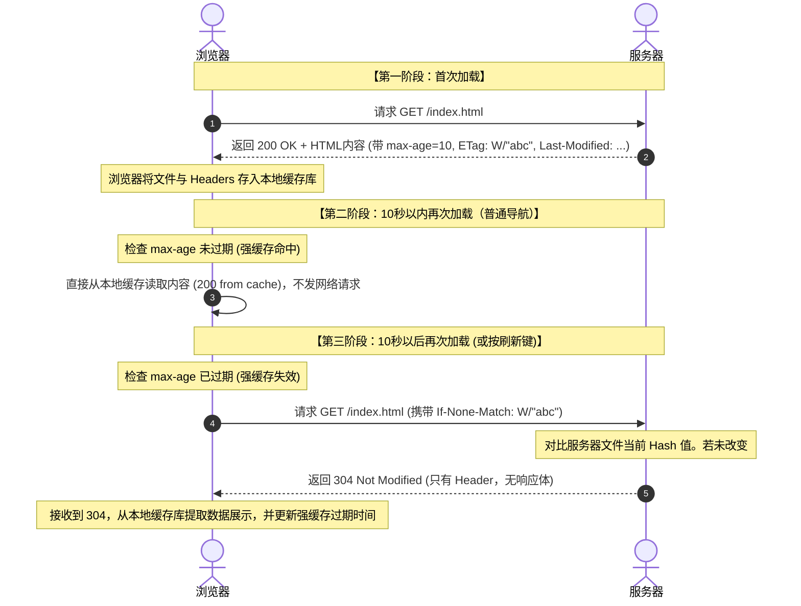

# HTTP 缓存极简实战与核心原理指南

HTTP 缓存是前端性能优化中最简单也最有效的手段。本文将结合一个极简的 Node.js/Express 项目源码，为你彻底剖析**强缓存**与**协商缓存**的工作机制，并解答在实战调试中常见的一些高频疑惑。

# 0. 历史演进：从 HTTP/1.0 的 Expires 到 HTTP/1.1 的 Cache-Control

在深入学习缓存机制前，我们有必要了解一下强缓存字段在 HTTP 协议发展史上的演进。这能让我们更加深刻地体会现代缓存字段的设计初衷。

## 1. HTTP/1.0 时代的强缓存：`Expires`

在 HTTP/1.0 规范中，强缓存主要通过 **`Expires`** 响应标头来控制。

- **工作方式**：服务器在返回资源时，会带上一个**绝对的格林威治时间戳**（例如：`Expires: Wed, 03 Jun 2026 18:00:00 GMT`）。在这个时间到达之前，浏览器直接使用本地缓存。
- **致命缺陷**：因为 `Expires` 返回的是一个**服务器的绝对时间**，而浏览器比对时使用的是**客户端（用户电脑）的本地系统时间**。一旦用户电脑的系统时间不准（比如时区设错，或者故意修改了时间），强缓存就会彻底发生偏差（可能导致缓存提前失效，或本该过期的缓存永久有效）。

## 2. HTTP/1.1 时代的破局者：`Cache-Control` (相对时间)

为了彻底解决绝对时间带来的不确定性，HTTP/1.1 规范引入了 **`Cache-Control`**，并带来了 **`max-age`** 属性（例如：`Cache-Control: max-age=10`，代表 10 秒）。

- **工作方式**：它采用的是**相对时间**。不管客户端的系统时间是多少，它只关注：_这个资源自被浏览器接收那一刻起，能在本地缓存存活多少秒_。这彻底摆脱了对客户端系统时间的依赖。

## 3. 两者并存时，谁的优先级更高？

- **`Cache-Control` 的优先级绝对高于 `Expires`**。
- 如果服务器的响应头中同时出现了 `Cache-Control: max-age=xxx` 和 `Expires`，现代浏览器会**自动忽略 `Expires`**，完全以 `Cache-Control` 为准。
- 如今在后端配置中保留 `Expires`，仅仅是为了给几十年前的古董浏览器（如 IE 早期版本）做向后兼容，现代应用中直接使用 `Cache-Control` 即可。

---

# 1. HTTP 缓存的三大行为分类

在 HTTP 协议中，缓存的控制逻辑可以归纳为以下三种行为：

| 缓存类型 | 代表指令 | 浏览器行为 | 协商验证机制 |
| :-- | :-- | :-- | :-- |
| **禁止缓存 (No-Store)** | `Cache-Control: no-store` | 浏览器在本地**不存储任何数据**。每次请求都会向服务器重新下载完整的文件。 | 无。必定返回 `200 OK` 并重新传输数据。 |
| **强缓存 (Strong Cache)** | `Cache-Control: max-age=10` | 在设定的**有效期内**，浏览器直接使用本地缓存，**完全不向服务器发起任何请求**（Network 面板耗时 `0ms`）。 | 无需验证。直接显示 `200 (from cache)`。 |
| **协商缓存 (Negotiation Cache)** | `Cache-Control: no-cache` 或 强缓存失效后 | 浏览器**必须发请求向服务器确认**本地缓存是否依然有效。在请求头里带上本地缓存的“暗号”（ETag/时间戳）。 | **若无修改**：服务器返回 `304 Not Modified`（无文件实体，秒级返回）。<br>**若已修改**：服务器返回 `200 OK`（包含最新内容）。 |

---

# 2. 强缓存与协商缓存的联合工作流程（以 `max-age=10` 为例）

强缓存与协商缓存并不是互斥的，在实际应用中，它们往往是**接力配合**的。我们以设置了 `Cache-Control: max-age=10` 并带有 `ETag` 的 `/index.html` 为例，看看它们是如何协同工作的：

## 🔄 联合缓存工作流时序图

[时序图传送门](https://mermaid.ai/play?utm_source=ai_live_editor&utm_medium=share#pako:eNqVVFtPGkEU_iuTeZIUcFEQ2KQ-tDW1qdqHmjRpeBlhuCQua5eltTUmxEQFK7eCeCNVU9GGIGCjyDX-GJkBnvgLnZVLae3NfZqT850z53zfN7sEraINQx568BsvdlvxExdySEiwuAH7kFcW3V5hDkvd2CqLEngkie88WALIA-hluHnqJ7tfB_MvsfS2m04GycbRbboDmBFlDEQl222i7qJ5cOOLNDKZetHX2inQ7GW7utc6SdDMEdk4bNZqN75op0O3TjM-3its5q7o-Qp4OjELhl1uG17UOmVhvoPuYDQM3a1j8Os42f8MRjgOvHgOHoDJ2ekpsrZKsiUwRIonQECLGuTAD3WcGkzMIgcPXg1bIJqzWqAaTCGPrJkWbS67C9t4oNVqVX9YjP_BDcmv0cR6vVKoF0NgEiMbljyAnO2Q1RRNZkgy36jGlLAc-3-aypt9mnRc4_RTvZJSllgL9hlrV_10N9vy7ZFctelPt6uBPoe_G_aLjx6kessz4dLN63WaPGCcVMvd-aK1evFM9asM_RaN_QsaStUrocGlmrkKCSd6_Cqk2yVRAFZkdWJVu7pZLwZJONqoRRuVZEfIe1glcJeDSGiQAzBE_Qm6GSD-K5rIt-JZ1T04IFff7nJwfE63_Kr7WZFNESkr1npm18yIbqyZRrLVOeCrOx7q9SO5Es3F-6-o4yJSi5FAEEwijxMQX_XGt9L8yIyUpvESCe_8y_ejnF65CPRMzJYLp2ky0DUmk4RuH5JYkJTj9VrsL-4OpWi8QPx5paMi5M-6MzPTcIRJT7fyNJgl51uN4zKDkVKBMp8k8n1KOxzT7UJr-wKqoUNy2SAvS16shgKWBKSEcEmZwwJlJxawBfLsaMN25J2XLdDiXmZlC8j9WhSFXqUkeh1OyNvRvIdF3gUbknt_tj4EM4Gkx6LXLUNeZ7xtAfkluAj50TGTdnRMZ-A4s95kMBtZ8j3k9Sat3mw2Gw0cy-g408jYshp-uL2U05qMhuXvymN2Rw)



## 📝 详细工作原理步骤：

1. **第一阶段：首次下载与保存**

   - 浏览器首次请求资源，服务器正常返回 `200 OK`，并通过 `Cache-Control: max-age=10` 告诉浏览器：“这个文件你可以直接用 10 秒”。同时服务器附带返回了文件指纹 `ETag: W/"abc"`。
   - 浏览器将文件数据和这些响应头存入本地缓存库。

2. **第二阶段：强缓存期（10 秒内）**

   - 用户在地址栏敲回车再次访问。浏览器检查本地缓存，发现时间未超过 10 秒，强缓存生效。
   - 浏览器**根本不向服务器发请求**，直接把本地缓存数据呈递给渲染引擎，完成秒开（`200 (from memory/disk cache)`）。

3. **第三阶段：强缓存失效，过渡到协商缓存（10 秒后）**
   - **强缓存失效**：10 秒钟过去后，或者用户手动点击了“刷新”键，强缓存判定失效。
   - **发送验证请求（合在 doc 请求中）**：浏览器不会直接全量下载 index.html。它会向服务器发一个 `GET /index.html` 验证请求，把之前存下的指纹塞进请求头中：`If-None-Match: W/"abc"`。
   - **服务端比对**：服务器收到请求，看到有 `If-None-Match` 暗号，重新计算服务器上该文件的当前哈希值。
     - **场景 A：文件内容未被修改**（服务器算出来的哈希依然是 `W/"abc"`）：
       - 服务器决定不传数据体，直接返回 **`304 Not Modified`** 响应。
       - 浏览器接收到 `304`，由于响应体是空的，网络传输开销极小。浏览器从本地缓存中读取原数据，并**重置该资源的强缓存倒计时 10 秒**，重新进入强缓存期。
     - **场景 B：文件内容已被修改**（你手动修改了 index.html，服务器算出来的哈希变为了 `W/"xyz"`）：
       - 服务器比对发现暗号不一致，返回 **`200 OK`**，并在响应体中携带**完整的最新文件数据**，同时在响应头塞入新的 `ETag: W/"xyz"`。
       - 浏览器下载新文件并更新本地缓存库。

---

# 2. 极简实战源码解读 (`server.js`)

以下是我们在演示 Demo 中使用的 Node.js/Express 后端服务代码。它完整展示了如何针对不同的静态文件应用不同的 HTTP 缓存头部策略：

```javascript
const express = require('express');
const app = express();

app.use(
  express.static('public', {
    etag: true, // 显式开启 ETag（文件指纹校验）
    lastModified: true, // 显式开启 Last-Modified（最后修改时间校验）
    setHeaders: (res, filePath) => {
      const hashRegExp = new RegExp('\\.[0-9a-f]{8}\\.');

      // 1. 对不带指纹的 HTML 资源设置极短强缓存（本例为 10 秒，生产推荐 no-cache）
      if (filePath.endsWith('.html')) {
        // res.setHeader('Cache-Control', 'no-cache');
        res.setHeader('Cache-Control', 'max-age=10');
      }
      // 2. 对包含 8 位 hex 版本的静态资源（如 js, css）设置强缓存（一年）
      else if (hashRegExp.test(filePath)) {
        res.setHeader('Cache-Control', 'max-age=31536000');
      }
    },
  }),
);

const PORT = process.env.PORT || 3000;
app.listen(PORT, () => {
  // 控制台打印蓝色日志
  console.log(
    `\x1b[34mHTTP Cache Demo server running on http://localhost:${PORT}\x1b[0m`,
  );
});
```

## 核心参数解析：

1. **`etag: true`**: 告诉 Express 在托管静态文件时，根据文件属性自动计算 ETag，并在 Response Header 中返回 `ETag`。
2. **`lastModified: true`**: 自动读取文件在操作系统磁盘上的**实际修改时间（mtime）**，格式化为 GMT 格式后写入 `Last-Modified` 响应头。
3. **`filePath.endsWith('.html')`**: 由于不带哈希的 HTML 页面内容可能会经常变化，为了保证实时性，生产环境推荐使用 `no-cache`。为了实验效果，此处在代码中配置了短时间的 `max-age=10`。
4. **`hashRegExp.test(filePath)`**: 对于带哈希指纹的打包文件（如 `app.15261a07.js`），因为哈希值变了 URL 就会变，所以它的内容永远不用担心被污染。我们可以激进地设置一年强缓存 `max-age=31536000`。

## 🛠️ 服务器端如何对接与比对 ETag 暗号？

在实际开发中，服务器端实现 ETag 校验主要分为**静态托管（自动处理）**和**自定义 API（手动处理）**两类情况。

### 1. 静态文件服务（本例使用的 `express.static`，框架全自动对接）

- **计算与发送**：当浏览器第一次请求静态文件时，Express 会自动读取文件在操作系统磁盘上的**大小 (size)**和**最后修改时间 (mtime)**。它会将这两者拼接起来并进行简单哈希，生成一个形如 `W/"文件大小-修改时间戳"` 的字符串，作为响应头的 `ETag` 返回给浏览器。
- **拦截与比对**：当浏览器第二次请求时，请求头会自动带上 `If-None-Match: W/"..."`。`express.static` 内部会自动拦截这个请求，读取这个值，然后再去读取磁盘文件的当前属性重新计算一次 ETag：
  - 如果计算出的最新 ETag 与客户端发来的一致，表明文件没变，中间件直接调用 `res.status(304).end()`，拦截请求，不返回具体内容。
  - 如果不一致，则返回最新文件内容和 `200` 状态。

### 2. 自定义 API 接口（手动在代码中对接 ETag）

如果你是自己写路由函数（如处理数据库查询 API），你想让这个动态数据支持 ETag 协商缓存以节省带宽，你可以通过 Node.js 内置的 `crypto` 模块手动进行比对：

```javascript
const express = require('express');
const crypto = require('crypto'); // 引入加密库
const app = express();

app.get('/api/user-data', (req, res) => {
  const data = { id: 100, name: 'yumeng', updated: '2026-06-03' };
  const dataStr = JSON.stringify(data);

  // 1. 手动计算数据的 MD5 Hash 值，作为 ETag 指纹
  const serverEtag =
    '"' + crypto.createHash('md5').update(dataStr).digest('hex') + '"';

  // 2. 获取浏览器自动带过来的 If-None-Match 暗号
  const clientEtag = req.headers['if-none-match'];

  // 3. 对接与比对：如果对上了暗号，证明数据未修改，直接返回 304 结束响应
  if (clientEtag && clientEtag === serverEtag) {
    console.log('数据未变，手动返回 304');
    return res.status(304).end(); // 无响应体传输，省流量！
  }

  // 4. 对不上暗号，或者首次请求：返回 200，发送数据并带上最新的 ETag
  res.setHeader('ETag', serverEtag);
  res.setHeader('Cache-Control', 'no-cache'); // 强制每次使用缓存前都来找我验证
  res.send(dataStr);
});
```

---

# 3. 实战调试与高频疑问解答

在利用上述代码启动服务并在 Chrome 中调试时，通常会遇到以下几个经典问题：

## Q1：为什么明明设置了 `max-age=10`，但我一按“刷新”键依然会发送请求？

**这是由浏览器的刷新机制决定的。这里需要区分“主文档（HTML）”与“子资源（JS/CSS/图片等）”：**

### 1. 主文档（HTML）的刷新表现

- 当你在浏览器中点击“刷新按钮”或者按下 `F5` / `Cmd + R` 时，浏览器会默认给当前**主页面请求**的标头塞入 `Cache-Control: max-age=0` 或 `no-cache`。
- 这样做的目的是强行让主页面绕过本地的**强缓存**阶段，直接向服务器发起协商验证，以确保用户能看到最新的页面框架。
- **正确测试主页面强缓存的方法**：在地址栏选中 URL，然后**直接按回车（Enter）键**，或者在网页里点击内部超链接进行正常页面跳转。在强缓存有效期内，完全不会有网络请求发生，Status 直接显示为 `200 (from memory/disk cache)`。

### 2. 子资源（JS/CSS/图片等）的刷新表现

- **你可能会发现：即便点击了刷新，页面里加载的带有强缓存的 JS 或 CSS 文件依然会显示为 `from cache`。**
- 这是因为浏览器的普通刷新（F5）主要针对当前地址栏的主文档。对于页面内部通过标签加载的子资源，只要它们仍在强缓存期内，大部分浏览器（如 Chrome）为了追求极速体验，**依然会直接读取本地缓存**，不向服务器发送任何请求。
- **如果需要强行让所有子资源重新向服务器发起请求，可以使用以下方法**：
  - **强制刷新 (Hard Reload)**：在 Mac 上按下 `Cmd + Shift + R`，Windows/Linux 上按下 `Ctrl + F5`。
  - **禁用缓存**：打开 F12 开发者工具，在 **Network (网络)** 面板顶部勾选 **`Disable cache` (停用缓存)** 选项（该选项仅在 F12 开启时生效）。

## Q2：如果把服务器的 `etag` 和 `lastModified` 都关闭，刷新页面会怎么样？

**会退化为每次刷新都要全量重新下载，造成带宽严重浪费。**

- 强缓存时间过期或用户点击刷新键后，浏览器必须向服务器确认资源状况。
- 由于服务器关闭了 ETag 和 Last-Modified，因此浏览器无法在 Request 中携带 `If-None-Match` 或 `If-Modified-Since` 的“暗号”；
- 服务器收到请求后无法进行文件状态判定，只能被动地重新发送 `200 OK`，并将完整的资源重新传输一次。

> [!TIP] 你可以在 Chrome 开发者工具的 Network 面板中关注 **Size** 这一列。如果是协商缓存命中（返回 `304`），传输大小一般仅为几百字节（只有 Headers）；如果是重载（返回 `200 OK`），传输大小则是完整文件的大小。

## Q3：怎么查看浏览器在协商缓存中发送的“验证请求”？

在 HTTP 协商缓存中，浏览器并不是直接发送“ETag”字样，而是将之前服务器返回 of ETag 值，放在请求头的 **`If-None-Match`** 字段中。查看步骤如下：

1. 按 `F12` 打开 DevTools，切换到 **Network (网络)** 面板。
2. 刷新页面（确保至少是第二次加载），在左侧列表中点击你的 HTML 请求。
3. 在右侧选择 **Headers (标头)** 标签页。
4. 滚动到 **Request Headers (请求标头)**，你会发现多了一个类似下面的字段： `If-None-Match: W/"29d-19ea3fc1c44"`
5. 同时，若要验证最后修改时间，你会在 Request Headers 中发现 `If-Modified-Since` 字段。

## Q4：若 `ETag` 和 `Last-Modified` 同时开启，谁的优先级更高？

**`ETag` 的优先级高于 `Last-Modified`**。如果在请求中同时携带了 `If-None-Match` (ETag) 和 `If-Modified-Since`，服务器在进行协商校验时，会优先比对 ETag。一旦 ETag 校验不匹配，服务器将直接判定缓存过期并返回 `200`，即便修改时间刚好能对得上。

> [!NOTE] > **为什么更推荐使用 ETag？**
>
> - **秒级限制**：`Last-Modified` 只能精确到秒。如果文件在 1 秒内修改了多次，时间戳不会变化，缓存会产生漏判。
> - **假保存**：文件只是保存了一下但内容根本没变，此时 Last-Modified 发生变化会导致缓存失效，而 ETag 仅仅基于文件内容做 Hash 判定，可以完美避免无意义的内容重传。

## Q5：假设 CSS 文件被强缓存了 1 年，但我临时做了一项紧急更新，如何让浏览器立即获取最新文件？

> [!IMPORTANT] > **⚠️ 核心前提提示：** 在 1 年的强缓存有效期内，浏览器是**绝对不会**向服务器发送任何请求的。此时，**即使你修改了服务器上的资源，导致 ETag（文件指纹）已经变了，也完全起不到任何作用**（因为浏览器压根没有发起请求，自然也就不会去对比 ETag）。因此，你唯一可行的办法就是 **“修改资源的网址（URL）”**，迫使浏览器认为这是一个全新的资源而发起请求。

这在工程中被称为 **缓存破除 (Cache Busting)**，主要有以下两种实现方案：

### 1. 文件名哈希指纹法（Filename Hashing）—— 现代前端最佳实践

- **实现方式**：将文件内容的哈希值作为文件名的一部分。例如，将 `style.css` 命名为 `style.391484cf.css`（本 Demo 采用的方式）。
- **原理**：一旦设计师修改了 CSS 代码，前端构建工具（如 Webpack, Vite 等）在重新打包时会依据最新内容生成全新哈希值的文件名（如 `style.b7cd32a1.css`）。对浏览器来说，这是一个**全新的 URL**，它会跳过旧文件的强缓存直接向服务器发起请求，拉取最新代码。
- **配合金牌策略：为什么 HTML 入口文件必须使用协商缓存（`no-cache`）？**
  - HTML 文件是引入所有 JS、CSS 资源的**“地图与索引”**。
  - **如果 HTML 也走强缓存**（比如缓存 1 个月），当你在服务器上重新发布了新哈希的 JS/CSS 并更新了 HTML 的引用路径时，用户的浏览器根本不会下载最新的 HTML。它依然会使用本地旧缓存的 HTML，在里面引用的自然依然是旧版 JS/CSS（旧文件一旦被清理，还会导致页面直接白屏）。
  - 因此，**HTML 必须设置为 `no-cache`（协商缓存）**。这样浏览器每次打开网页前，都必须带着 ETag 去服务器问一句。一旦发版，服务器发现 HTML 变了，就会返回最新的 HTML 内容（`200 OK`，里面写着新 JS/CSS 的哈希路径）。浏览器拿到新地图后，再去拉取对应的最新静态资源。这一整套闭环才得以运转。

### 2. 查询参数/版本号法（Query String）

- **实现方式**：在引用的资源 URL 后面追加查询参数，例如将 `<link href="style.css?v=1.0.1">` 变更为 `style.css?v=1.0.2`。
- **原理**：大多数浏览器会将带不同参数的 URL 视作不同请求，进而重新加载。
- **致命痛点**：某些老旧的代理服务器或 CDN 在缓存资源时，会**默认忽略 URL 问号后面的参数**。它们会误认为 `style.css?v=1.0.2` 和之前的 `style.css?v=1.0.1` 是同一个文件，从而依然返回旧的缓存副本。因此，目前在生产环境中已经基本被废弃。

---

# 3.5 延伸探讨：数据接口（API）也会使用 HTTP 缓存吗？

在实际项目开发中，很多开发者会有一种直觉：“HTTP 缓存是专门给 JS、CSS、图片等静态文件准备的，动态数据接口（API）不用做缓存”。这个直觉大部分是对的，但并不绝对。

## 1. 为什么 90% 的动态接口默认禁用缓存？

- **实时性与正确性要求极高**：诸如购物车、订单状态、未读通知等接口，数据随时在变。如果被浏览器强缓存了，用户刷新页面也看不到最新的数据状态，会造成严重的业务逻辑故障。
- **隐私与安全风险**：API 数据通常是千人千面的（例如 `/api/user-profile`）。如果配置不妥导致这些包含隐私的 API 响应被 CDN 或公共代理服务器缓存了，极有可能会引发 A 用户登录后看到 B 用户个人信息的重大安全事故。
- **默认安全选择**：因此，绝大多数涉及交易、用户状态、增删改查的动态接口，后端服务器都会默认在响应头中下发 `Cache-Control: no-store`，要求浏览器和代理服务器绝不缓存。

## 2. 哪些动态接口适合使用 HTTP 缓存？

虽然对 API 的缓存要十分克制，但在以下特定业务场景下，接口缓存是保障服务器不被冲垮的性能利器：

- **静态配置类接口**：
  - **例子**：省市区三级联动数据、国家代码列表、行业分类配置、全局系统菜单。
  - **特点**：全网用户看到的数据完全一样，且几个月甚至一年才变动一次。
  - **方案**：非常适合在响应头设置长期的强缓存（如 `Cache-Control: max-age=86400` 缓存一天）或使用 `ETag` 协商缓存，每次仅用极小代价换回 `304`，避免重复传输大量静态 JSON。
- **高并发公共榜单接口（配合 CDN 缓存）**：
  - **例子**：商城的商品热卖榜单、微博热搜、公开博客的文章详情。
  - **特点**：短时间内并发请求极大，且对秒级实时性要求不是百分百严苛。
  - **方案**：通常配合 **CDN 节点** 开启短时间强缓存（如 `Cache-Control: public, max-age=60` 缓存 1 分钟）。这 1 分钟内的百万次查询都会被 CDN 拦截并直接响应，服务器只需每分钟响应一次 CDN 的源头更新，极大地保护了后端数据库。
- **配合 ETag 的动态数据兜底**：
  - **方案**：有些动态接口虽不能用强缓存，但可以开启 `no-cache` + `ETag`。浏览器每次使用前都发送 `If-None-Match` 暗号，若后台判断数据库中该用户的数据未发生变动，直接返回 `304`。虽然依然会有一次网络往返，但**完全省去了庞大数据体在网络上的传输时间**。

---

# 4. 最佳实践建议

在实际工程项目中（如 SPA 单页应用中）：

1. **入口 HTML 文件**（如 `index.html`）：使用 `Cache-Control: no-cache`。强制要求浏览器每次都在本地保存页面，但每次使用前必须通过 `ETag` 确认版本有无更新，这是获取前端最新版本的根本保障。
2. **构建打包生成的静态文件**（包含内容哈希，如 `style.a8ef89b2.css`, `bundle.71f54da1.js`）：使用 `Cache-Control: max-age=31536000`（强缓存）。内容变了 URL 就会变，因此可以放心地强缓存一年，彻底减轻服务器在静态资源传输上的开销。
